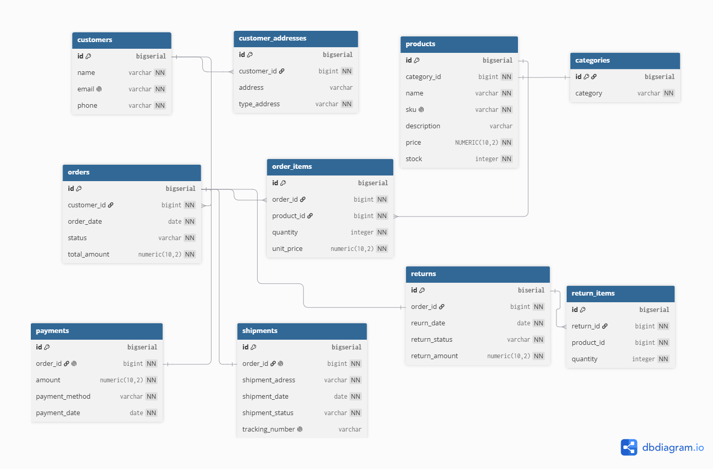

# PostgreSQL E-Commerce Analytics Project

## Overview

This project simulates a real-world e-commerce database and demonstrates advanced PostgreSQL concepts through business analysis, reporting, automation, and performance optimization.

The database was designed to support customer management, product catalog management, order processing, payments, shipments, and product returns.

The project includes business-oriented SQL queries, views, materialized views, functions, stored procedures, triggers, window functions, indexes, and transaction management.

---

## Database Schema

The database consists of the following entities:

* Customers
* Customer Addresses
* Orders
* Order Items
* Products
* Categories
* Payments
* Shipments
* Returns
* Return Items

### Entity Relationship Diagram (ERD)



---

## Technologies Used

* PostgreSQL
* SQL
* PL/pgSQL
* Git
* GitHub
* dbdiagram.io

---

## Business Questions Solved

This project answers several business questions, including:

* Top customers by revenue
* Revenue by category
* Monthly sales performance
* Product return analysis
* Customer segmentation
* Inventory monitoring
* Average order value (AOV)
* Product performance analysis
* Customer ranking
* Revenue trends over time

A total of **20 business-oriented SQL queries** were developed.

---

## Views

The project includes the following views:

### vw_sales_details

Provides detailed sales information including customers, products, categories, quantities, prices, and line totals.

### vw_inventory_status

Tracks inventory movement by comparing stock, units sold, and returned products.

### vw_customer_revenue

Summarizes customer revenue, total orders, and average order value.

### vw_category_performance

Measures category-level sales performance.

### vw_product_return_performance

Calculates return rates and return metrics by product.

---

## Materialized Views

### mv_customer_revenue

Precomputed customer revenue summary used for reporting and dashboarding.

### mv_monthly_sales_summary

Monthly business performance summary including:

* Total Orders
* Revenue
* Average Order Value

Materialized views are refreshed using:

```sql
REFRESH MATERIALIZED VIEW;
```

---

## Functions

The following user-defined functions were implemented:

### get_customer_revenue()

Returns total revenue generated by a customer.

### get_customer_orders_count()

Returns the number of completed orders for a customer.

### get_category_revenue()

Returns total revenue generated by a category.

### get_product_return_rate()

Returns return percentage for a product.

### get_customer_tier()

Classifies customers as:

* BRONZE
* SILVER
* GOLD
* PLATINUM

based on total revenue.

---

## Stored Procedures

### cancel_old_pending_orders()

Automatically cancels pending orders older than 30 days.

### refresh_reporting_data()

Refreshes all reporting materialized views.

---

## Triggers

### Stock Update Trigger

Automatically updates product inventory when a sale occurs.

### Product Price Audit Trigger

Tracks price changes and stores audit information.

---

## Window Functions

The project demonstrates advanced analytical SQL techniques using:

### RANK()

Top-selling products by category.

### DENSE_RANK()

Customer ranking by revenue.

### LAG()

Month-over-month revenue comparison.

### LEAD()

Revenue comparison with the following month.

### SUM() OVER()

Running cumulative revenue analysis.

---

## Performance Optimization

Several indexes were implemented to improve query performance:

```sql
CREATE INDEX idx_orders_customer
ON orders(customer_id);

CREATE INDEX idx_orders_status_date
ON orders(status, order_date);

CREATE INDEX idx_order_items_product
ON order_items(product_id);

CREATE INDEX idx_products_category
ON products(category_id);
```

Query execution plans were analyzed using:

```sql
EXPLAIN ANALYZE
```

---

## Transactions

The project demonstrates transaction management using:

```sql
BEGIN;
COMMIT;
ROLLBACK;
```

to ensure data consistency and integrity.

---

## Key Skills Demonstrated

* Relational Database Design
* Data Modeling
* SQL Querying
* Business Analytics
* Window Functions
* Database Automation
* Performance Optimization
* Transaction Management
* PL/pgSQL Development
* Git & GitHub

---

## Future Improvements

Possible future enhancements include:

* Role-based security
* Partitioning
* ETL pipelines
* PostgreSQL performance benchmarking
* Data warehouse integration
* Power BI dashboards
* Apache Airflow workflows

---

## Author

**Dania Carmenate**

PostgreSQL E-Commerce Analytics Project
